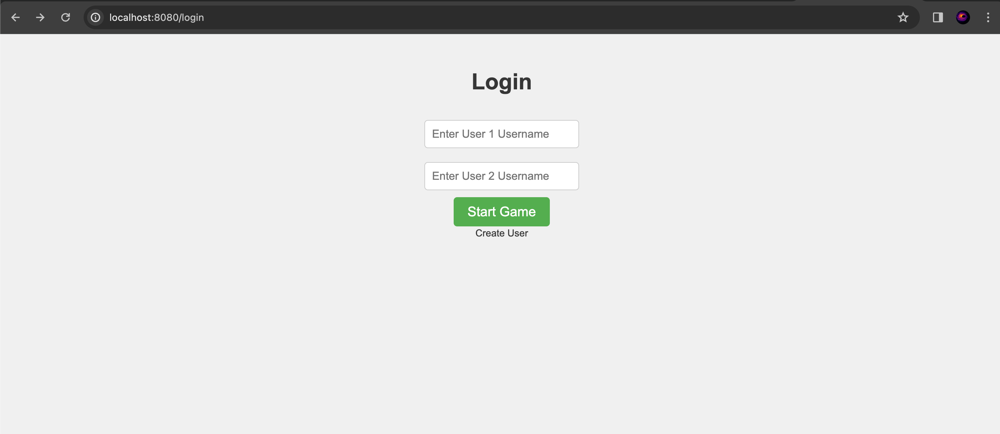
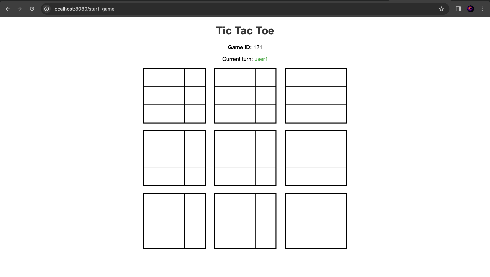
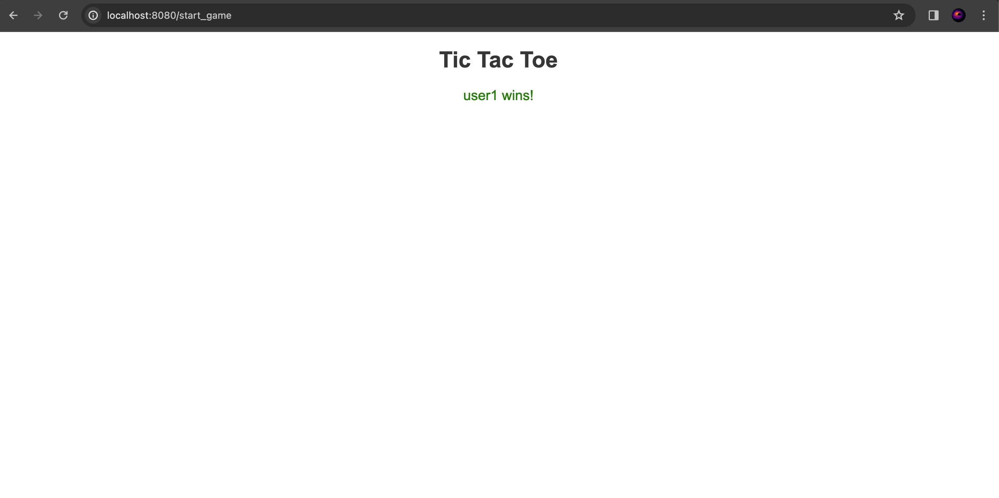
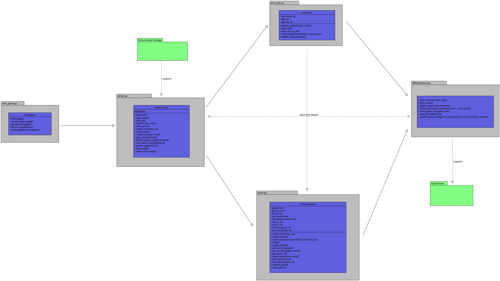

## PROJECT TITLE: SUPER TIC TAC TOE WEB GAME
- This is a simple and interactive super tic tac toe game designed for web browsers.

## Functionalities:
#### Player registration:
New players can register their username into the database using the registration page.

#### Player login:
Players that are already registered can use their usernames to create a new game.

#### Creation of a game:
An already existing user can create a new game, and add new players to it.

#### Determine the winner of a game:
The game can determine and display the winner of a game.

#### More functionalities:
- Check if a player already exists
- Making a move in a game
- Check if a player has played

## Techonologies used:
- Python: The server-side logic is implemented using Python with the Bottle web framework

- HTML/CSS/JavaScript: Our project uses HTML for the front-end implementation, making use of templates to ensure a correct game display and user-friendly interface. CSS and JavaScript are yet to be implemented, however they will be used to improve the appeareance and functionality of the front-end interface.

- Bottle Framework: For the back-end implementation of our project, we use the Bottle framework. The Bottle framework handles the routing and server-side logic, facilitating communication between client and server.

- SQLAlchemy: As our persistence solution we implemented a database using SQLAlchemy. The database currently stores players, games, player's statistics, and the status of games. In addition, JSON is used to serialize the matrix that represents the game board before storing it on the database.

#### Changes made:
- We were able to expand our Tic Tac Toe game to a Super Tic Tac Toe Game. 

- The UML Diagrams were changed to display the changes made in our codes and to maintain a consistent style across all of them.

- We decided to change from SQLite3 to SQLAlchemy for working with the SQL database, because SQLite3 was giving us some issues that we could not fix on time.

#### UML Diagram:

