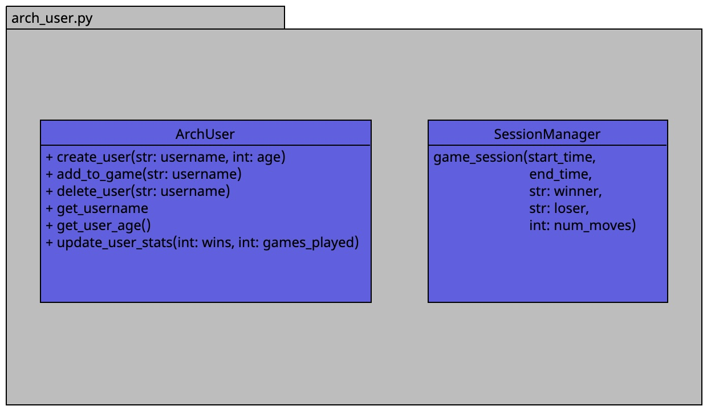

For the user info part of this project, the following features will be required. 
* Note: These features may require some changes in the future. 

The features;
An ArchUser class that takes care of creating, deleting, and adding a user to a game. The methods
of this class includes;
* add_user_to_db method that adds a user to the database
* assign_symbol class method that assign symbols to the users ready to play.
* get_users class method that returns a list of all user objects stored in the database.
* check_players method that checks if the usernames entered during login is valid.
* A delete_user method - to delete only registered profile from the game.

