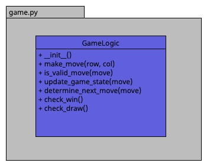

# Architecture Document for Game Logic Module

## Module: GameLogic

### Overview:
The `GameLogic` module is responsible for managing the core logic of the game. It encapsulates functionalities related to initializing game state, handling player moves, checking for game outcomes (win or draw), and maintaining the game state.

### Classes and Methods:

#### Class: GameLogic

- **Constructor (`__init__` method):**
  - *Purpose:* Initializes the game state.
  - *Parameters:* None.

- **`make_move` Method:**
  - *Purpose:* Handles a player's move in the game.
  - *Parameters:* Takes the player making the move and move-related data as input.
  - *Returns:* Returns a boolean indicating whether the move was successful.

- **`is_valid_move` Method:**
  - *Purpose:* Checks if a move is valid.
  - *Parameters:* Takes move-related data as input.
  - *Returns:* Returns a boolean indicating whether the move is valid.

- **`update_game_state` Method:**
  - *Purpose:* Updates the game state after a valid move.
  - *Parameters:* Takes move-related data as input.
  - *Example:* Modifies the internal data structure to reflect the player's move.

- **`determine_next_move` Method:**
  - *Purpose:* Determines the next move in the game (if applicable).
  - *Parameters:* Takes move-related data as input.
  - *Example:* Calculates the next valid move based on the last player's move.

- **`check_win` Method:**
  - *Purpose:* Checks for a win condition in the game.
  - *Parameters:* None.
  - *Returns:* Returns a boolean indicating whether there is a win.

- **`check_draw` Method:**
  - *Purpose:* Checks for a draw condition in the game.
  - *Parameters:* None.
  - *Returns:* Returns a boolean indicating whether there is a draw.

## UML Diagram:

