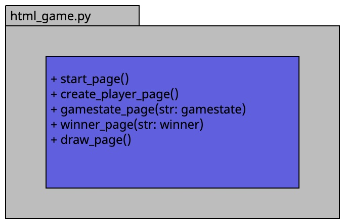

# HTML Component Interface Summary

The HTML component serves as the user interface layer of the application, responsible for rendering dynamic web pages and facilitating user interactions. It encapsulates various templates for different pages and provides methods to generate HTML content dynamically.

## Interface Methods

1. `start_page(cls)`: 
   - Generates the start page HTML code.

2. `create_player_page(cls)`: 
   - Generates the player creation page HTML code with a form.

3. `gamestate_page(cls, gamestate)`: 
   - Generates the game state page HTML code with information about the current state of the game.
   - Args: 
     - `gamestate` (String) - The state of the game.

4. `winner_page(cls, winner)`: 
   - Generates the winner page HTML code with a message indicating the winner.
   - Args: 
     - `winner` (String) - The name of the winner.

5. `draw_page(cls)`: 
   - Generates the draw page HTML code with a message indicating a draw.

Each method returns a string containing the corresponding HTML code for the specific page.

