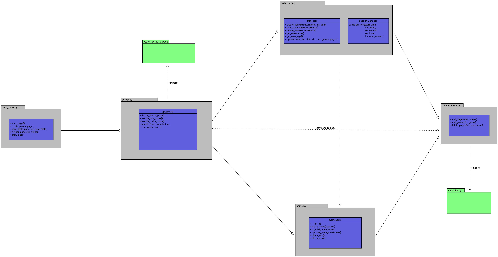

# Project Title: Online Game Platform

## Overview

The Online Game Platform is a web-based application designed to host various online games with interactive user interfaces. The platform facilitates player registration, game creation, gameplay, and persistence of game data between user sessions. It utilizes a combination of server-side logic implemented in Python, front-end development using HTML/CSS/JavaScript, and database management with SQLite3.

## Initial Functionality

1. Player Registration: Users can register and create player profiles to participate in games.
2. Game Creation: Players can create new games and invite other registered players to join.
3. Game Lobby: Players can log in to the game lobby to view available games and join existing ones.
4. Gameplay: Players can make moves and interact with the game interface to play various online games.
5. Game Progression: The platform tracks game progress, updates game state based on player actions, and determines game outcomes.
6. Persistence: Game data is stored in a SQLite3 database, allowing for the persistence of game records between user sessions.

## Technologies Used

- Python: The server-side logic is implemented using Python with the Bottle web framework.
- HTML/CSS/JavaScript: The front-end interface is built using standard web technologies to provide an interactive user experience.
- Bottle Framework: Used to handle routing and server-side logic, facilitating communication between the client and server.
- SQLite3: Database management is handled by SQLite3, enabling the storage and retrieval of game data.

## Updated UML Diagram

The UML diagram depicts the architecture of the Online Game Platform, including the components for player registration, game management, and interaction between the client and server.

The components include user management, game creation, gameplay, and database storage, illustrating the flow of data and interactions within the platform.
