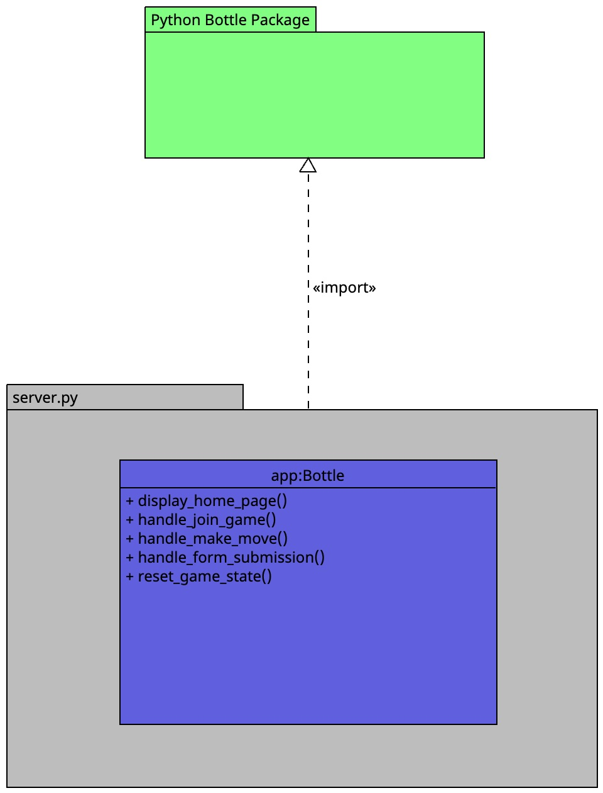

# Web-based Game Server

This component serves as the backend server for hosting and managing online games. It utilizes a WSGI server and URL endpoint routing to handle incoming requests from clients and facilitate game interactions through a web-based user interface.

## Routes

- GET /: Displays the home page or landing page for the game.
- POST /join_game: Handles requests from users to join or start a new game session.
- POST /make_move: Processes player moves or actions within the game.
- POST /submit_form: Handles form submissions for collecting user information or game-related data.
- GET /reset_game: Resets the game state to its initial configuration.
- ...

## Interface Methods

1. `display_home_page(cls)`: Generates and displays the home page HTML content.
2. `handle_join_game(cls)`: Handles requests from users to join or start a new game session.
3. `handle_make_move(cls)`: Processes player moves or actions within the game.
4. `handle_form_submission(cls)`: Processes form submissions for collecting user information or game-related data.
5. `reset_game_state(cls)`: Resets the game state to its initial configuration.
6. ...

Each method encapsulates functionality related to a specific route or action within the game server.

## UML Diagram

The UML diagram provides an overview of the architecture of the web-based game server, illustrating the interactions between different components and the flow of data within the system.
