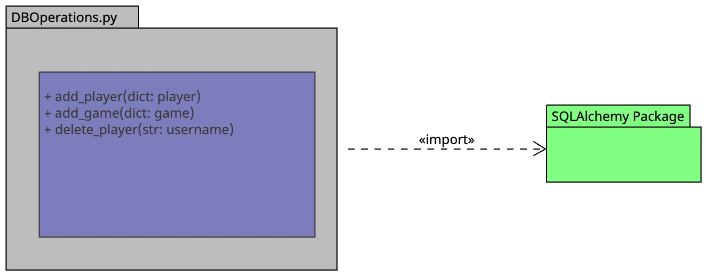
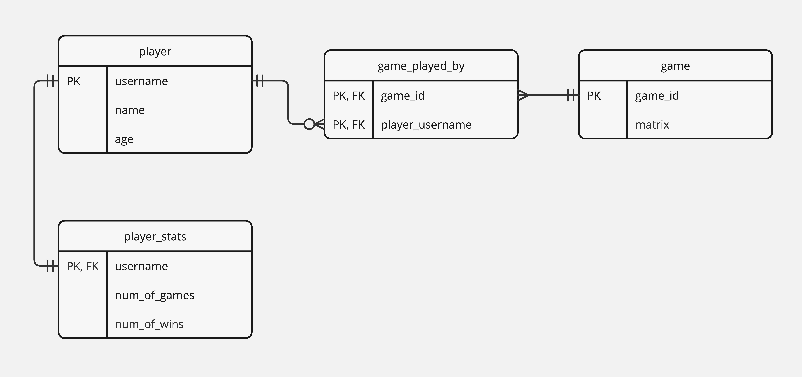

# Database Management Module

The database management module serves as the persistence layer for the game server, utilizing a relational database system (e.g., SQLite) to store and manage game-related data records. It provides functions to interact with the database, including storing player information, game state, and managing player-game relationships.

## Functions

1. `add_player(player)`: Stores the given player data in the database.
   - Parameters:
     - `player` (dict): Player object to be stored in the database.

2. `add_game(game)`: Stores the given game data in the database.
   - Parameters:
     - `game` (dict): Game object to be stored in the database.

3. `delete_player(username)`: Deletes the player with the matching username from the database.
   - Parameters:
     - `username` (str): Username of the player to be deleted from the database.

## UML Diagram

The UML diagram illustrates the structure and relationships within the database management module, including the entities and their attributes, as well as the functions for interacting with the database.

## ER Diagram

