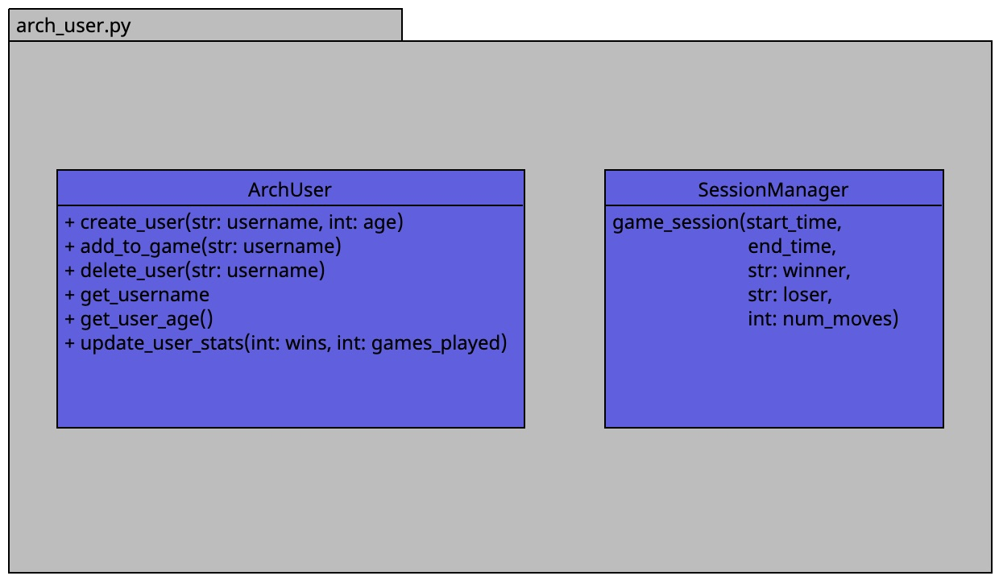

# User Management Module

The user management module is responsible for handling user-related functionalities within the game server, including user creation, deletion, and profile management. It also includes features for recording game sessions and storing relevant game data.

## ArchUser Class

The `ArchUser` class encapsulates user information and provides methods for managing user profiles within the game server.

### Methods:

1. `create_user(username, age)`: Creates a new user profile with the specified username and age.
2. `add_to_game(username)`: Adds the user with the given username to the current game session.
3. `delete_user(username)`: Deletes the user profile with the matching username from the game server.
4. `get_username()`: Returns the username of the current user.
5. `get_user_age()`: Returns the age of the current user.
6. `update_user_stats(wins, games_played)`: Updates the user's game statistics with the provided win count and total games played.

## SessionManager Class

The `SessionManager` class manages game sessions and records relevant session data for analysis and reporting purposes.

### Methods:

1. `game_session(start_time, end_time, winner, loser, num_moves)`: Records a game session with details such as start time, end time, winner, loser, and number of moves made during the game.

## UML Diagram

The UML diagram illustrates the structure and relationships within the user management module, including the `ArchUser` class with its methods for user profile management and the `SessionManager` class for recording game sessions.
