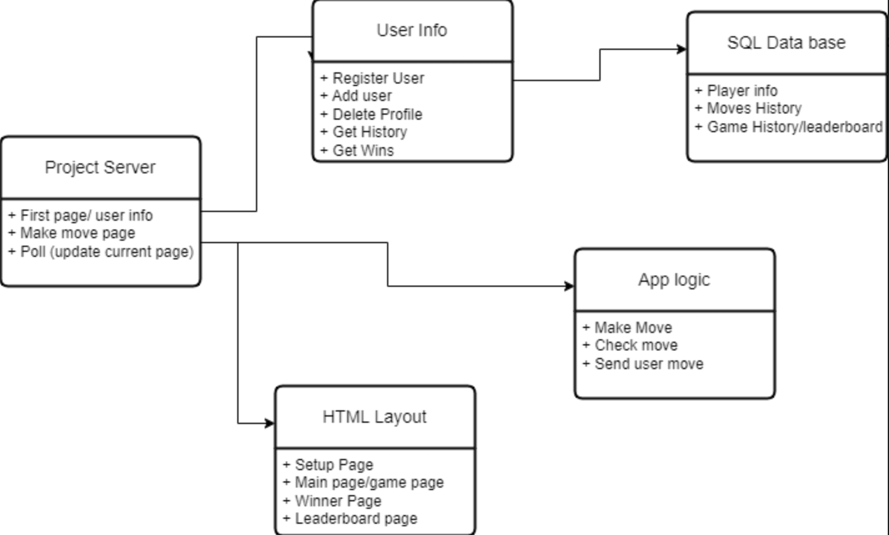

## Feb 09, 2024

**Recorded by:** Flavio Cesar Mendoza Trinidad
**Notes submitted on:** 09/02/2024  
**Venue:** EN 1054 Classroom  
**Source:** None   
**Time:** 2:00PM - 2:50PM  
**Attendance:** Said, Christopher, Kaleb, Flavio, Mohammad

We discussed the implementation of the server and the project, and we came up with
an approach to it. We decided to use sqlite3 as the persistence solution for our project.
We talked about the responsibilities of each team member, and the team members who
will be working closely together. Finally, a UML was created in order to give us and idea
of the implementation of the project.

